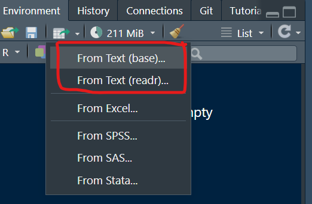

```{r setup, include=FALSE}
knitr::opts_chunk$set(echo = TRUE)
```


# Introduction à R et Rstudio

## R

-   Logiciel open-source

-   Langage orienté vers le traitement, l'analyse des données et que la visualisation des données

-   Rédaction de rapport (word, powerpoint, pdf et html)

### Installation

-   Sous windows: [Télécharger ici](http://cran.r-project.org/bin/windows/base/)
-   Sous Mac OS X: [Télécharger ici](http://cran.r-project.org/bin/macosx/){style="blue"}

\newpage

## Rstudio

-   Environnement de développement intégré pour R

### Installation: [Télécharger ici](http://www.rstudio.com/products/rstudio/download/)

# Importation de fichier

bonjour

## Importation des fichiers textes (.txt,.csv)


bonjour


### Importation graphique

bonjour

{fig-align="center"}

### Utilisation d'un script

bonjour

## Importation des fichiers excel (.xls ou .xlsx)

bonjour

Pour l'importation des fichiers excel, on peut utiliser les packages `readxl` ou `xlxs`

``` r
raw_data <- readxl::read_xlsx("data/QUESTIONNAIRE_2025-03-16.xlsx")
```

# Introduction à la gestion avancée des données avec R

bonjour

## Lecture des données

bonjour

## Concepts avancés de manipulation des données avec `tidyverse` et `data.table`

bonjour

### Concepts avancés de manipulation des données avec `tidyverse`

### Concepts avancés de manipulation des données avec `data.table`

# Optimisation du traitement des grands ensembles de données

# Programmation fonctionnelle et manipulation efficace des données

# Analyse exploratoire et modélisation

# Techniques avancées de visualisation avec `ggplot2` et `plotly`

# Méthodes statistiques et modélisation prédictive avec `caret` et `randomForest`

# Analyse des séries temporelles avec `forecast`

# Traitement des données et automatisation

## Automatisation du nettoyage des données avec `tidymodels`

## Optimisation des performances d’analyse avec `parallel` et `bigmemory`

# Interaction entre R et Python avec `reticulate`
